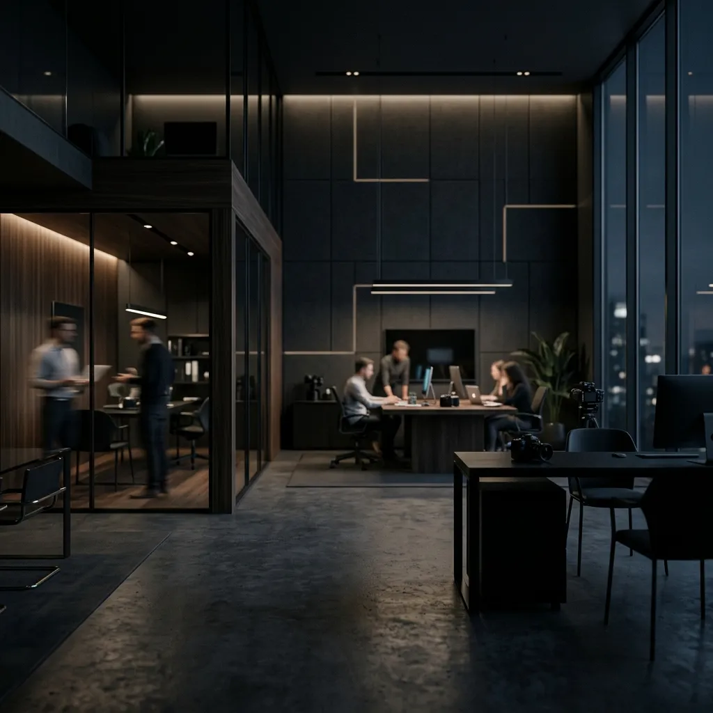
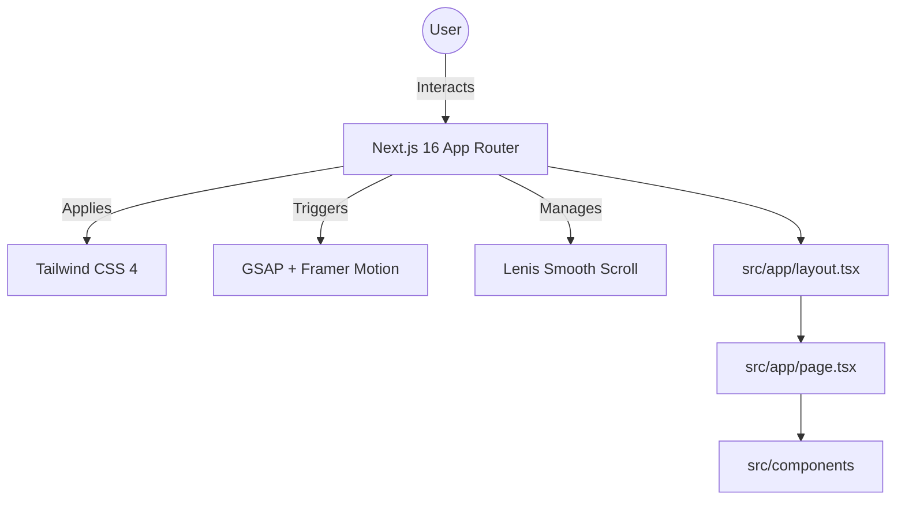
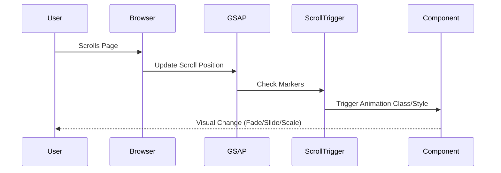

<div align="center">


# 🎨 Floka Studio | Digital Agency

### High-End Digital Solutions for Modern Brands

<div align="center">
  <a href="https://floka-studio.vercel.app/">
    
  </a>
  <a href="https://floka-studio.vercel.app/">
    
  </a>
</div>

<p align="center">
  A premium, performance-optimized digital agency landing page featuring immersive animations, smooth scrolling, and a cutting-edge visual aesthetic.
</p>

</div>

---

## 📋 Table of Contents

- [📖 Introduction](#-introduction)
- [✨ Key Features](#-key-features)
- [🎯 Feature Showcase](#-feature-showcase)
- [📊 System Architecture](#-system-architecture)
- [⚙️ Tech Stack](#️-tech-stack)
- [📁 Project Structure](#-project-structure)
- [🚀 Getting Started](#-getting-started)
- [🤝 Contributing](#-contributing)

---

## 📖 Introduction

**Floka Studio** is a state-of-the-art digital agency website designed to showcase high-end creative work. Built with **Next.js 16** and **React 19**, it prioritizes visual excellence and smooth user interactions. The platform features:

- 🪄 **Immersive GSAP Animations** for scroll-triggered excellence
- 🌊 **Smooth Scrolling** via Lenis integration
- ✨ **Framer Motion Micro-interactions** for a premium feel
- 📱 **Fully Responsive Layout** crafted with Tailwind CSS 4
- 🖱️ **Custom Interactive Cursor** for enhanced engagement
- 🧭 **Optimized Performance** with Next.js 16 features

---

## ✨ Key Features

### User Experience
- 🚀 **Fluid Navigation** - Seamless transitions between sections.
- 🎨 **Modern Aesthetics** - Dark/Light mode compatible (White theme default) with vibrant accents.
- 📏 **Precision Layouts** - Pixel-perfect components using Tailwind CSS 4.
- ⚡ **Performance First** - Optimized for high frame rates even with complex animations.

### Sections
- 🏠 **Hero Section** - Impactful entrance with particle effects or dynamic typography.
- 💼 **Portfolio Showcase** - High-resolution presentation of creative projects.
- 👥 **Team Reveal** - Interactive member profiles with hover effects.
- 📊 **Company Expertise** - Detailed breakdown of services and technical skills.
- 💬 **Testimonials & FAQs** - Clean, animated feedback and informational sections.
- 📧 **Contact Hub** - Integrated contact section for lead generation.

---

## 🎯 Feature Showcase

The interface is designed to be responsive, intuitive, and visually stunning.

### 🏠 Homepage & Interaction

| User Interface | Feature Details |
| :---: | :--- |
| <div align="center"></div> | **Creative Portfolio**<br><br>A visually engaging grid featuring top-tier projects with hover-state reveals. |
| <div align="center"></div> | **Video Reel**<br><br>Immersive high-definition video backgrounds for a grand cinematic experience. |
| <div align="center"></div> | **Expertise Showcase**<br><br>Dynamic presentation of core competencies and agency strengths. |

---

## 📊 System Architecture

### Frontend Data & Interaction Flow



### Animation Orchestration



---

## ⚙️ Tech Stack

### Core
- **Framework**: Next.js 16 (App Router)
- **Library**: React 19
- **Language**: TypeScript

### Styling & Animation
- **Styling**: Tailwind CSS 4, CSS Variables
- **Animations**: GSAP (GreenSock), Framer Motion
- **Scrolling**: Lenis (@studio-freight/lenis)
- **Icons**: Lucide React

### Fonts
- **Typography**: Funnel Display (via Google Fonts)

---

## 📁 Project Structure

```bash
Floka-Studio/
├── public/                     # Static assets (images, logos, svgs)
├── src/
│   ├── app/                    # Next.js App Router (Layouts, Pages, Globals)
│   │   ├── layout.tsx          # Root layout with Navbar/SmoothScroll
│   │   ├── page.tsx            # Main landing page assembly
│   │   └── globals.css         # Global styles & Tailwind directives
│   ├── components/             # Reusable UI components (Hero, Portfolio, etc.)
│   │   ├── Navbar.tsx          # Dynamic navigation
│   │   ├── Hero.tsx            # Main entrance component
│   │   └── ...                 # Other layout sections
│   └── lib/                    # Utility functions and configurations
│
├── tailwind.config.ts          # Tailwind configuration (if applicable)
├── package.json                # Project dependencies and scripts
└── tsconfig.json               # TypeScript configuration
```

---

## 🚀 Getting Started

### Prerequisites
- **Node.js**: 18.x or higher
- **npm/yarn/pnpm**: Package manager

### Installation

1. **Clone the repository**
   ```bash
   git clone https://github.com/CodeCommandBD/Floka-Studio.git
   cd Floka-Studio
   ```

2. **Install Dependencies**
   ```bash
   npm install
   ```

3. **Run Development Server**
   ```bash
   npm run dev
   ```

   Visit `http://localhost:3000` (or the port specified in your terminal)

---

## 🤝 Contributing
Contributions are welcome! If you have suggestions for improvements or new features, feel free to open an issue or submit a pull request.

1. Fork the Project
2. Create your Feature Branch (`git checkout -b feature/AmazingFeature`)
3. Commit your Changes (`git commit -m 'Add some AmazingFeature'`)
4. Push to the Branch (`git push origin feature/AmazingFeature`)
5. Open a Pull Request

---

<div align="center">
  <b>Elevating Digital Experiences. Built with Passion. 🚀</b>
</div>
